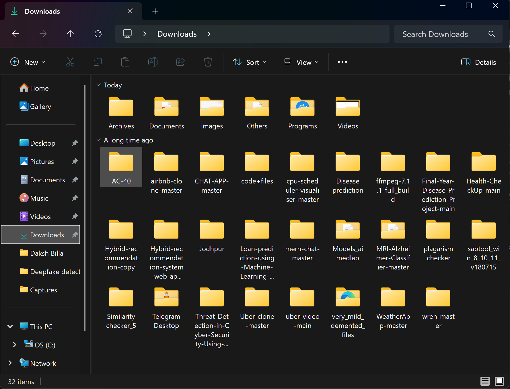

📁 Smart Folder Organizer 

A simple command-line utility that automatically organizes files in a folder (like Downloads) into categorized subfolders and also supports reverting the changes safely.

🔍 Problem Statement

My Downloads folder gets cluttered with different types of files such as documents, images, videos, archives, and installers.
Manually organizing them is time-consuming and often leads to mistakes.

There is no simple built-in tool that:

Organizes files automatically

Allows undo/revert in case of a mistake

💡 Solution

This project provides a CLI-based folder organizer that:

Sorts files into folders based on file type

Creates folders automatically

Moves unknown file types into an Others folder

Logs all changes

Allows reverting files back to their original location

✨ Features

📂 Automatic file organization

🔁 Revert / Undo support

🗂️ Handles Others folder safely

🧾 Logging for safe recovery

⚙️ Uses standard Python libraries only

🖥️ Cross-platform (Windows / Linux / macOS)

🛠️ Technologies Used

Language: Python 3

Libraries:

os – file system interaction

shutil – file moving operations

sys – command-line arguments

(All are standard libraries)

📁 Folder Categories
Folder Name	File Types
Images	.jpg, .jpeg, .png, .gif
Documents	.pdf, .docx, .txt, .pptx
Videos	.mp4, .mkv, .avi
Archives	.zip, .rar
Programs	.exe, .msi
Others	Unknown file types
▶️ How to Run
1️⃣ Organize Files
python folder_cleaner.py organize <folder_path>

Example:

python folder_cleaner.py organize C:\Users\Daksh\Downloads

2️⃣ Revert Files (Undo)
python folder_cleaner.py revert <folder_path>

This restores all files to their original location using the log file.

🔁 Revert Mechanism (Undo Support)

During organization, all file movements are stored in organize_log.txt

Each entry records:

filename | destination_folder

The revert command reads this log and safely moves files back

This ensures data safety and prevents accidental data loss.

📸 Sample Output
✅ Organized 24 files successfully.
🔁 Reverted 24 files successfully.

Screenshots included in submission:

After revert

🎥 Video Demonstration

A 3–5 minute unlisted YouTube video demonstrating: https://youtu.be/AY1KyMemLvs

Problem statement

Program execution

Folder organization

Revert functionality

Design decisions

🧠 Design Decisions

CLI-based: Lightweight and fast

Logging-based revert: Safe and reliable undo

Dictionary-based rules: Easy to extend

Standard libraries only: No external dependencies

Modular functions: Clean and readable code

🚀 Possible Enhancements

Dry-run mode (preview changes)

Custom rules via config file

GUI using Tkinter

Duplicate file detection

Timestamp-based organization

✅ Conclusion

This project demonstrates:

Problem understanding

Clean coding practices

Error handling

Reversible system design

Practical real-world usefulness

👤 Author

Daksh
(Command Line Utility Assignment)